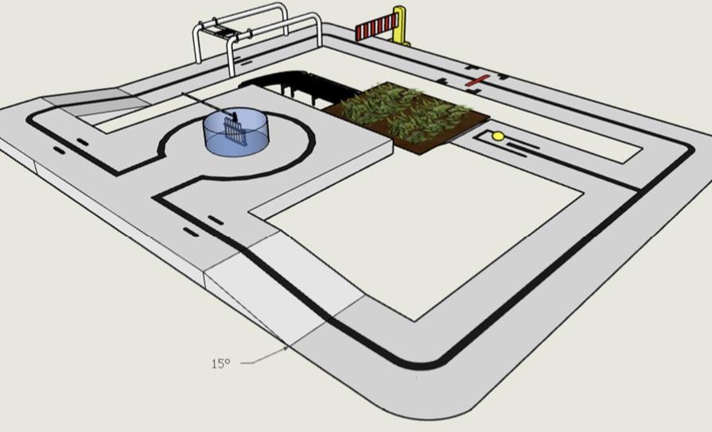
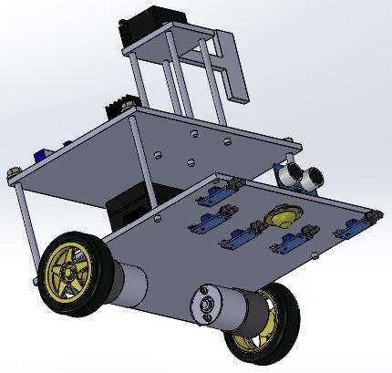
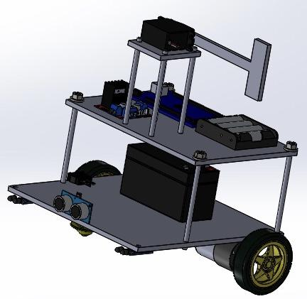
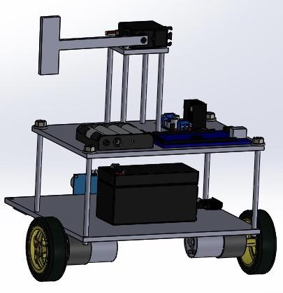

# Autonomous_Robot
## Description
- This robot software was developed as a part of a robot competition which you can find its specification in the SpaceLab.pdf file.
- The software combines motor control speed software with line follower software to get an autonomous stable robot that can perform multiple mechanical tasks required in the robot specification.
- If you are interested in the robot design as mention the images below you find a mechanical_design.zip file containing the mechanical design of the rebot which requires Solidworks:

